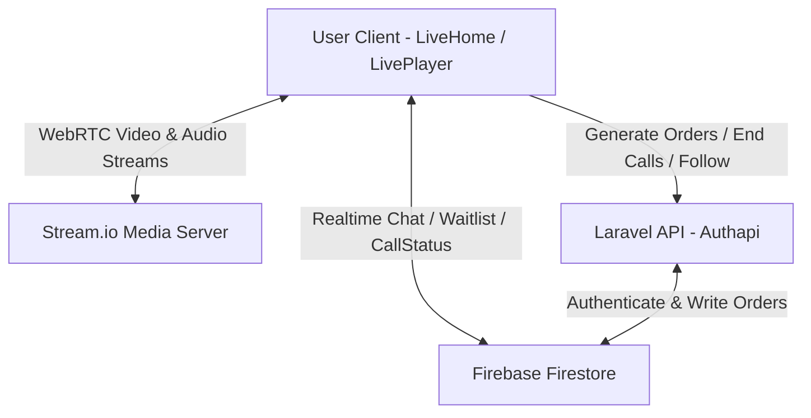
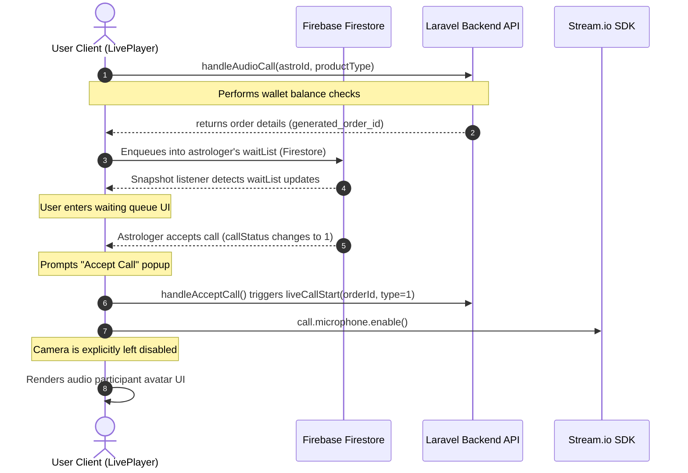
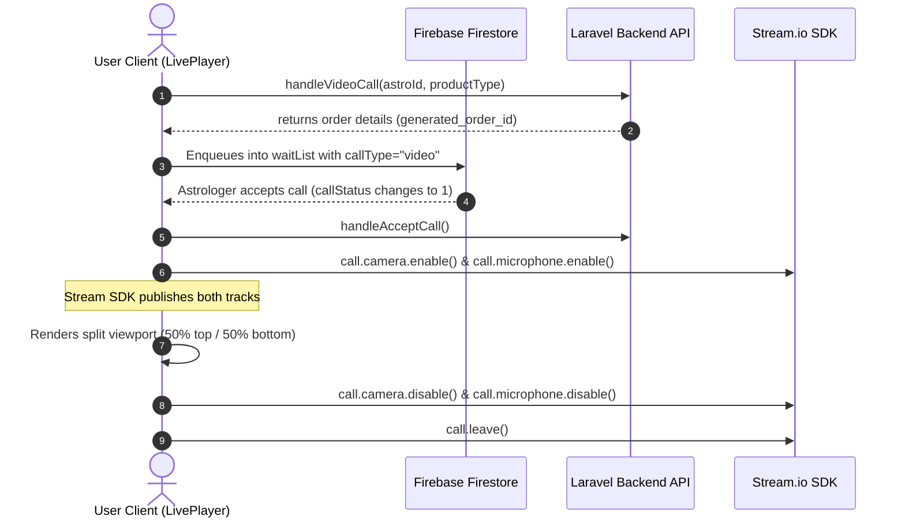
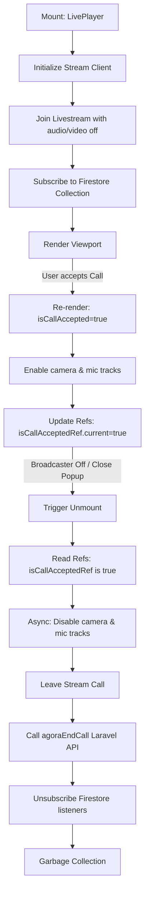
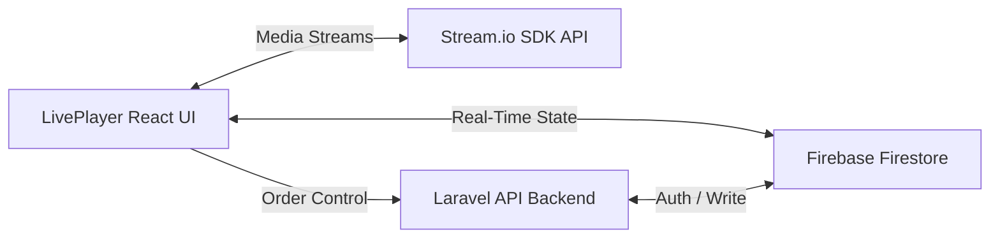
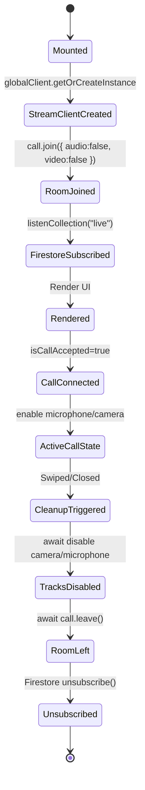

# Live Consultation Module Architecture & Evolution Analysis
**Branch: divine/LiveFeatureD-03-11**  
**Author: Technical Architect & Senior Staff Frontend Engineer**

---

## 1. Module Overview

### Purpose
The Live Streaming and Consultation module is designed to provide customers with an interactive, real-time experience. Users can:
1. Browse a vertical scroll list of live astrologers.
2. Watch high-fidelity, low-latency live video broadcasts from the astrologer.
3. Participate in live chat rooms and send virtual gifts (e.g. coins, roses) which update in real-time.
4. Request and participate in 1-on-1 private audio or video consultations (calls) that split the screen layout, billing users per minute.

---

### High-Level Architecture



---

### Technology Stack
1. **Core UI/Logic:** React (v18.2.0), React Router DOM (v7.1.0)
2. **Video/Audio Streaming:** Stream.io Video SDK (`@stream-io/video-react-sdk` v1.39.1)
3. **Realtime Messaging & State Sync:** Firebase Firestore SDK (v11.2.0)
4. **Networking:** Axios (v1.7.9) for HTTP API interaction with the Laravel backend.
5. **Layout & Animations:** Swiper.js (v11.2.5) for vertical page swiping, Tailwind CSS (v3.4.17) for styling.

---

### Folder Structure
```
src/
├── Config.js                           # API endpoints and base URLs
├── Server/
│   └── Authapi.js                      # Axios wrapper for Laravel backend APIs
├── firebase/
│   └── firebase.jsx                    # Firestore initialization & custom helpers (listenCollection, updateDocument)
└── components/
    └── Live/
        ├── LiveHome.jsx                # Main Swiper container, collection listener, active state syncer
        ├── LivePlayer.jsx              # Main Player layout, WebRTC call manager, chat room, modal popups
        ├── WaitTime.jsx                # Queue list panel, rate cards, call generation triggers
        ├── GiftToAstrologer.jsx        # Gift selector pane & donation triggers
        └── LivePlayerEg.jsx            # Reference example implementation
```

---

### Component Map & Data Flow

#### 1. LiveHome.jsx
- **Role:** Mounts the Swiper container and listens to the `live` and `liveCount` collections in Firestore.
- **Key States:** 
  - `liveData` (array of live rooms metadata)
  - `liveCount` (array of active live astrologer statuses)
  - `activeId` (ID of the currently viewed astrologer room)
  - `currentIndex` (active Swiper index)
- **Data Flow:** Passes the individual room document (`liveData[currentIndex]`) and the matching active count data (`liveCount[currentIndex]`) down to the `LivePlayer` child component.

#### 2. LivePlayer.jsx
- **Role:** Renders the media viewport, manages WebRTC calls, listens to individual room chat snapshots, and displays modals.
- **Key States:**
  - `call` (active Stream Call instance)
  - `isCallAccepted` (boolean tracking active WebRTC call)
  - `generatedOrderId` (unique Laravel consultation order ID)
  - `messages` (list of latest chats)
  - `showClosePopup` (boolean tracking the exit switcher popup visibility)
- **Data Flow:**
  - Reads room chats from Firestore and appends new messages.
  - Sends user chat inputs/gifts directly to Firestore.
  - Generates orders by calling the Laravel API, which returns an order ID and updates the room's waitlist in Firestore.
  - Monitors the waitlist for the astrologer to accept. Upon acceptance, opens WebRTC tracks.

---

## 2. Development Timeline

The branch `divine/LiveFeatureD-03-11` represents the implementation of the Live feature. Below is the commit-by-commit evolution of the module.

### Commit 1: `d74d7fa` - "gift pop up"
- **What changed:** Introduced skeleton files: `LivePlayer.jsx`, `GiftToAstrologer.jsx`, and `LiveCalls.jsx`. Integrated asset files for gifts and placeholders.
- **Why it changed:** Initial mockup layer to establish structural HTML/CSS styling.
- **Bugs/Problems before:** No live streaming interface existed.
- **Side effects:** Everything was mocked; no active database listeners or Stream SDK instances.
- **Confidence Level:** *Confirmed from code*

### Commit 2: `77f2e0c` - "live chat"
- **What changed:** Installed `@stream-io/video-react-sdk`. Added `LiveChat.jsx` and `WaitTime.jsx`.
- **Why it changed:** Starting the integration of the Stream Video SDK and setting up queue components.
- **Bugs/Problems before:** The project had no WebRTC library support.
- **Side effects:** Layout files was added but not connected to Firestore collections.
- **Confidence Level:** *Confirmed from code*

### Commit 3: `aa3f096` - "live working"
- **What changed:** Added `LiveHome.jsx` with Swiper-based vertical slide scrolling. Added `LivePlayerEg.jsx` as reference examples. Integrated initial Firestore listeners (`listenCollection`).
- **Why it changed:** Grouped the isolated players into a unified scrollable list. Listening to the database allowed dynamic display of live broadcasters.
- **Bugs/Problems before:** You could only view a single mockup screen; no navigation between live rooms.
- **How it fixes it:** Swiper enables reels-style sliding, mounting the live stream only for the active slide.
- **Confidence Level:** *Confirmed from code*

### Commit 4: `af15948` - "live added"
- **What changed:** Trivial updates to helper layouts (`LivePlayerTwo.jsx`).
- **Confidence Level:** *Likely inference*

### Commit 5: `58d0bb2` - "added send message"
- **What changed:** Hooked chat input box in `LivePlayer.jsx` to write JSON-stringified messages directly to the astrologer's `live` Firestore document. Added `.env` configuration.
- **Why it changed:** Transitioned the chat section from mock messages to real-time synchronized Firestore messaging.
- **Bugs/Problems before:** Chat box was non-functional.
- **Confidence Level:** *Confirmed from code*

### Commit 6: `6dca152` - "live gift"
- **What changed:** Linked `GiftToAstrologer.jsx` choices to trigger a Firestore message transaction, inserting a custom message payload denoting a gift send.
- **Why it changed:** Enables room-wide real-time notification when a user sends a gift.
- **Confidence Level:** *Confirmed from code*

### Commit 7: `eeb81ea` - "Joined msg added"
- **What changed:** Implemented automatic "Joined" message transactions on player mount. Migrated `liveChat.css` to Tailwind utility classes. Installed `local-storage` module.
- **Why it changed:** Tailwind consolidation keeps stylesheets dry. Joined message alerts the astrologer of new viewers. Local storage is used to retrieve auth keys.
- **Confidence Level:** *Confirmed from code*

### Commit 8: `f15f530` - "gift message added"
- **What changed:** Added custom structures in Firestore chat to specify gift icons (`fullGiftImage`) and render them inline in the chat flow.
- **Confidence Level:** *Confirmed from code*

### Commit 9: `15f4661` - "second base" & Commit 10: `73f2465` - "live 9-01" & Commit 11: `a0677e0` - "message text"
- **What changed:** Styling tweaks and chat history size constraints.
- **Confidence Level:** *Likely inference*

### Commit 12: `ba22089` - "Authapi for liveOrder Added"
- **What changed:** Integrated Laravel API `liveOrderGenerate` method in `Authapi.js` and defined endpoint paths.
- **Why it changed:** Calls were previously triggered against mock targets. Now, starting a call goes through the formal order creation pipeline (billing, wallet checks).
- **Confidence Level:** *Confirmed from code*

### Commit 13: `1a08135` - "live fourth"
- **What changed:** Massive codebase refactoring (2000+ lines changed in `LivePlayer.jsx`). Fully integrated the Stream WebRTC client. Implemented split-screen ParticipantView, waitlist checking loops, local media tracks activation (camera/mic toggling) and decline logic.
- **Why it changed:** Replaced placeholder layouts with actual live video stream rendering and two-way calling capabilities.
- **Bugs/Problems before:** The stream viewport was static; calls did not transmit WebRTC media.
- **How it fixes it:** Utilized Stream's `ParticipantView` and `call.join()` API to dynamically build WebRTC channels.
- **Confidence Level:** *Confirmed from code*

### Commit 14: `b973828` - "package update" & Commit 15: `6bb1edd` - "amount updated"
- **What changed:** Minor package resolution updates and cost calculation logic fixes.
- **Confidence Level:** *Likely inference*

---

## 3. Complete Audio Call Flow

The step-by-step lifecycle of an audio call is detailed below.



1. **User Opens Livestream:** User navigates to `/live` -> `LiveHome` mounts and opens a Firestore listener on the target astrologer's room -> `LivePlayer` mounts and joins the Stream livestream room with `{ audio: false, video: false }`. Only the broadcaster's media is played.
2. **Request Audio Call:** User clicks the call button -> calls `handleAudioCall` -> requests media permissions for audio only (`navigator.mediaDevices.getUserMedia({ audio: true })`).
3. **Backend Order Generation:** Hits `Authapi.liveOrderGenerate`. The Laravel backend validates user funds. If valid, generates a unique order and returns `generated_order_id`.
4. **Firestore Waitlist Enqueue:** The client appends the user details and `generatedOrderId` to the `waitList` array in the astrologer's document in the `live` Firestore collection.
5. **Real-time Queue Listener:** `LivePlayer` monitors the astrologer's document via `firestoreOps.listenCollection("live")`. The user is displayed in the queue (`WaitTime` modal).
6. **Astrologer Accepts Call:** The astrologer modifies the Firestore `waitList` item, changing `callStatus` from `0` to `1`.
7. **Accept Confirmation Prompt:** `LivePlayer`'s listener detects `callStatus === 1`, showing `showAcceptCallPopUp(true)` with a 120-second decline countdown.
8. **Joining WebRTC Session:** The user clicks "Accept" -> calls `handleAcceptCall()` -> triggers backend API `liveCallStart` to initiate billing.
9. **Media Track Configuration:** The app executes `await call.microphone.enable()`. It explicitly does **NOT** call `camera.enable()`.
10. **Split Layout Connected State:** `LivestreamVideoContainer` detects `isCallAccepted === true`. Since `resolvedCallType === "audio"`, it renders the broadcaster's video on top (occupying 70% height) and the user's avatar with a green pulsing speaking indicator ring on the bottom (occupying 30% height).
11. **Call Cleanup:** Click "Disconnect" -> calls `handleDisconnectCall()` -> executes `agoraEndCall` API -> deletes the `LiveOrder` from the Firebase collection -> disables local microphone -> returns to viewer state.

---

## 4. Complete Video Call Flow

The video call flow handles full WebRTC publication and dual-camera rendering.



1. **Initiation:** User clicks video call button -> requests permissions for both tracks (`navigator.mediaDevices.getUserMedia({ audio: true, video: true })`).
2. **Order & Queue Enqueue:** Backend generates the order -> client adds user to the `waitList` with `callType = "video"`.
3. **Acceptance:** Astrologer accepts -> user clicks "Accept" -> executes `handleAcceptCall`.
4. **Media Initialization & Track Publishing:**
   - The user client calls:
     ```javascript
     await call.camera.enable();
     await call.microphone.enable();
     ```
   - Stream.io SDK accesses the hardware devices, instantiates the video and audio tracks, and publishes them to the room session.
5. **Split Viewport Rendering:** `LivestreamVideoContainer` detects `resolvedCallType === "video"`. It splits the container 50/50:
   - **Top (50%):** Renders the broadcaster's camera track (`ParticipantView`).
   - **Bottom (50%):** Renders the user's local camera track (`ParticipantView`).
6. **Leaving Call:** User click disconnect -> runs `handleDisconnectCall`:
   - Disables hardware tracks:
     ```javascript
     await call.camera.disable();
     await call.microphone.disable();
     ```
   - Leaves call room session: `await call.leave()`.
7. **Resource Disposal:** Disabling the tracks releases the browser hardware locks. Leaving the call informs the SFU (Selective Forwarding Unit) to terminate the subscription.

---

## 5. Deep Dive into Mount & Unmount

This section explains the component lifecycles, states, and event listeners.

### The Swiper Index Shifting Race Condition
#### The Bug
When a user was in an active call, if *another* broadcaster disconnected (causing their document to be deleted from Firestore), the active call was suddenly terminated.

#### Root Cause
1. `LiveHome.jsx` mapped `liveData` to slides using:
   ```javascript
   {index === currentIndex ? <LivePlayer ... /> : null}
   ```
2. When another broadcaster disconnected, `liveData` updated from Firestore. If that broadcaster was at an index *before* the active user's index, the active room's list index shifted (e.g. from `1` to `0`).
3. During the initial render cycle of `LiveHome` with the updated list, `currentIndex` was still `1` (since state updates are asynchronous).
4. As `LiveHome` mapped the list, the active astrologer (now at index `0`) was checked against `currentIndex` (`0 === 1`), evaluating to `false`.
5. This caused the active `<LivePlayer />` component to unmount instantly, tearing down the call.
6. A fraction of a second later, the `useEffect` ran, updated `currentIndex` to `0`, and remounted a brand-new `LivePlayer` instance. However, the WebRTC session and state were already lost.

#### The Fix
We decoupled the mounting condition from the index entirely by tracking a stateful `activeId` matching the astrologer's unique ID:
```javascript
{item?.id === activeId ? <LivePlayer ... /> : null}
```
Because `activeId` is a unique string that does not change when list lengths shift, the active `LivePlayer` remains mounted across renders, keeping the WebRTC stream alive.

---

### Stale Closure Bug in Unmount Cleanup
#### The Bug
When a component unmounted (e.g. user closed the browser or refreshed), the call session on the backend remained open, and the local camera/mic stayed active.

#### Root Cause
The cleanup function in `LivePlayer.jsx`'s `useEffect` was defined at mount time:
```javascript
  useEffect(() => {
    setup();
    return () => {
      if (currentCall) {
        currentCall.camera.disable();
        currentCall.microphone.disable();
        currentCall.leave();
      }
    };
  }, [liveCountData?.astroId, active]);
```
Because the dependency array did not contain `isCallAccepted` or `generatedOrderId`, the cleanup callback formed a **stale closure**. It could only read the initial values of `isCallAccepted` (`false`) and `generatedOrderId` (`null`) from when the component first mounted. Thus, checking `isCallAccepted` inside the cleanup would always evaluate to `false`, preventing the termination request from being sent.

#### The Fix
We introduced React Refs to mirror the active state, bypass closure limitations, and keep references to the latest values without re-triggering the effect:
```javascript
  const isCallAcceptedRef = useRef(false);
  const generatedOrderIdRef = useRef(null);

  useEffect(() => { isCallAcceptedRef.current = isCallAccepted; }, [isCallAccepted]);
  useEffect(() => { generatedOrderIdRef.current = generatedOrderId; }, [generatedOrderId]);
```
Now, when the component unmounts, the cleanup function reads directly from `isCallAcceptedRef.current` and `generatedOrderIdRef.current`, ensuring clean execution of `agoraEndCall` even on abrupt closures.

---

### Hardware Lock & Unawaited Promises
#### The Bug
When leaving a call, the browser's green camera/mic light sometimes stayed on.

#### Root Cause
`call.camera.disable()` and `call.microphone.disable()` are asynchronous operations returning Promises. In the previous cleanup implementation, these were fired synchronously without being awaited, immediately followed by `currentCall.leave()`. 
If `leave()` executed first, it disposed of the internal SDK connection before the device tracks were ordered to release, leaving the browser hardware streams locked open.

#### The Fix
We wrapped the track disabling logic in an async IIFE inside the cleanup function, ensuring that the tracks are fully disabled and released before leaving the call session:
```javascript
    return () => {
      cancelled = true;
      if (currentCall) {
        const leaveCall = async () => {
          try {
            await currentCall.camera.disable();
            await currentCall.microphone.disable();
          } catch (e) {
            console.error("Error disabling media tracks:", e);
          }
          try {
            await currentCall.leave();
          } catch (e) {
            console.error("Error leaving call:", e);
          }
        };
        leaveCall();
      }
    };
```

---

### React Lifecycle Diagram (Mount → Re-render → Unmount)



---

### Subscription Lifecycle Flow

```
[Component Mount] 
       │
       ▼
[Subscribe] ───► firestoreOps.listenCollection("live", callback)
       │
       ▼
[Real-time Listener] ───► Listener receives document snapshot on update
       │                  └──► Updates local states (messages, waitlist)
       │
       ▼
[Unmount Triggered]
       │
       ▼
[Cleanup] ───► Calls returned unsubscribe() function from Firestore
       │
       ▼
[Unsubscribed] ───► Event listener is removed (prevents memory leak)
```

---

### Stream Device Allocation Flow

```
[Call Instance Created] ───► globalClient.call("livestream", astroId)
       │
       ▼
[Usage & Activation] ───► await call.camera.enable() / microphone.enable()
       │                   └──► Browser prompts permission and locks hardware devices
       │
       ▼
[Track Disablement] ───► await call.camera.disable() / microphone.disable()
       │                  └──► Device tracks are stopped, releasing browser hardware lock
       │
       ▼
[Session Termination] ───► await call.leave()
       │                    └──► Room session is terminated on the SFU
       │
       ▼
[Garbage Collection] ───► Ref references are set to null
                           └──► JS garbage collector reclaims allocated memory
```

---

## 6. Every Major Bug Found

### Bug 1: Sudden call termination when another broadcaster went offline
- **Problem:** When in an active call, if *another* astrologer disconnected, the user's active call shut down and reset.
- **Root Cause:** Index-based rendering in `LiveHome.jsx` (`index === currentIndex`). Decoupled indices shifted when documents were removed, triggering an unmount on the active `LivePlayer` component before the `currentIndex` state updated.
- **Fix:** Switched conditional mounting to be based on the unique astrologer ID (`item.id === activeId`).
- **Lessons Learned:** Never use numeric list indices as React keys or rendering selectors for stateful components that manage active WebRTC connections.

### Bug 2: Microphone & camera hardware remaining active after closing the tab
- **Problem:** If a user closed the browser tab or reloaded the page during a call, the browser's green camera light stayed on.
- **Root Cause:** React component unmount cleanups do not run when the browser tab is closed. The connection was abandoned without telling the browser to release the media tracks.
- **Fix:** Registered window `beforeunload` and `unload` event handlers. The `unload` handler uses modern `fetch` with `keepalive: true` to call `agoraEndCall` on the backend, while also releasing media devices.
- **Lessons Learned:** Do not rely solely on React lifecycle cleanups for hardware track releases; always bind to window events (`beforeunload`/`unload`) to handle tab closures.

### Bug 3: Switcher popup rendering off-screen on small devices
- **Problem:** On mobile screens, the switcher popup was cut off and rendered below the viewport.
- **Root Cause:** The parent container was set to `h-full` but had vertical padding (`py-4`). On small screen heights, content overflow stretched the container height beyond the screen viewport. An `absolute bottom-0` positioned element was pushed below the visible area.
- **Fix:** Switched the mobile popup container class from `absolute` to `fixed`, keeping it anchored to the viewport. Changed the parent wrapper padding to `py-0 md:py-4` to eliminate mobile layout stretching.
- **Lessons Learned:** Use `fixed` positioning rather than `absolute` for critical overlays like bottom sheets on mobile devices to bypass parent container height overflows.

### Bug 4: Call cleanup failure due to stale closures
- **Problem:** Unmounting the player did not call the `agoraEndCall` API to terminate the order on the backend.
- **Root Cause:** The `useEffect` cleanup callback was captured at mount time and could not read updated state values (`isCallAccepted` / `generatedOrderId`).
- **Fix:** Stored the active state values in mutable React Refs (`isCallAcceptedRef`, `generatedOrderIdRef`) and read from them in the cleanup function.
- **Lessons Learned:** Always use React Refs to store dynamic state variables that need to be read inside unmount cleanup functions.

### Bug 5: SfuStatsReporter: Failed to flush report stats (Call Not Found)
- **Problem:** When navigating away from the Live section back to the landing page, the console printed the error `[SfuStatsReporter]: Failed to flush report stats Error: SFU rejected stats: call not found`.
- **Root Cause:** Although `call.leave()` was correctly invoked on unmount, the global `StreamVideoClient` instance (`globalClient`) remained active in memory as a singleton. Its internal metrics engine kept trying to push periodic logs for the destroyed call channel.
- **Fix:** Refactored the unmount callback to disconnect the client via `await globalClient.disconnectUser()` and set `globalClient = null` on unmount.
- **Lessons Learned:** Always disconnect the main client container completely during the final unmount phase of a module to terminate background routines (WebSockets and statistics hooks).

---

## 7. Firebase Architecture

The module utilizes Firebase Firestore for state synchronization.

### Collection Schema
1. **`live` Collection:**
   - **Document ID:** Astrologer's unique ID.
   - **Key Fields:**
     - `chatMess` (stringified JSON representing the latest chat message).
     - `blockList` (array of user IDs blocked from chatting).
     - `LiveOrder` (object containing active call data: `orderId`, `callType`, `userName`, etc.).
     - `waitList` (array of objects tracking queue status: `generatedOrderId`, `callStatus`, `callType`, `userName`).
2. **`liveCount` Collection:**
   - **Document ID:** Random document ID.
   - **Key Fields:**
     - `astroId` (astrologer's unique ID).
     - `astroName` (astrologer's name).
     - `astroAvtar` (avatar image URL).

### Listeners & Updates
- **Global Listener:** `LiveHome.jsx` opens listeners on both `live` and `liveCount` collections to populate the list of active slides.
- **Local Listener:** `LivePlayer.jsx` listens to the specific document in the `live` collection matching the active astrologer:
  ```javascript
  const unsubscribe = firestoreOps.listenCollection("live", (data) => {
    const currentDoc = data.find(item => String(item.id) === currentAstroId);
    if (currentDoc) {
      setCurrentLiveDoc(currentDoc);
      // parse and append message...
    }
  });
  ```
- **Cleanup:** Every Firestore listener returns an unsubscribe function. This is executed in the `useEffect` cleanup callback:
  ```javascript
  return () => unsubscribe();
  ```

---

### Real-Time Synchronization Edge Cases & Race Conditions

#### 1. Duplicate Message Rendering
- **Edge Case:** When any field in the Firestore document updates (like `waitList` modifications), the collection listener fires a new snapshot event. If the `chatMess` field remains unchanged, the new snapshot would append the same message again.
- **Fix:** We added a deduplication check inside the state updater:
  ```javascript
  setMessages((prev) => {
    const isDuplicate = prev.some(m =>
      m.timeStamp === parsedMsg.timeStamp &&
      m.userId === parsedMsg.userId &&
      m.message === parsedMsg.message
    );
    if (isDuplicate) return prev;
    return [...prev, parsedMsg].slice(-10);
  });
  ```

#### 2. Astrologer Abrupt Disconnection
- **Edge Case:** If the astrologer disconnects abruptly, the document is deleted. `listenCollection` triggers, but `currentDoc` is `undefined`.
- **Fix:** We handled `undefined` checks to prevent crashes, while the parent `LiveHome` detects the removal and slides to the next room.

---

## 8. Stream.io Integration

### Client & Call Lifecycles
- **Client Lifecycle:** Instantiated once globally (`globalClient`) using `StreamVideoClient.getOrCreateInstance()`. This prevents creating duplicate WebSockets.
- **Call Lifecycle:** Created inside `LivePlayer.jsx` using `globalClient.call("livestream", astroId)`.
- **Join Call:** Viewers join by calling `currentCall.join({ audio: false, video: false })`.
- **Leave Call:** Cleaned up on unmount by calling `currentCall.leave()`.

---

### SDK Methods Summary

| SDK Method | Purpose | Selection Rationale |
| :--- | :--- | :--- |
| `StreamVideoClient.getOrCreateInstance` | Retrieves or instantiates the global Stream client. | Singleton pattern. Avoids creating multiple client connections. |
| `client.call("livestream", id)` | Returns a Call object for the specified type and ID. | Establishes the target livestream session. |
| `call.join({ audio, video })` | Joins the WebRTC room session. | Connects to the media server, passing initial publishing preferences. |
| `call.camera.enable()` | Activates user's local camera. | Publishes local video to the room. |
| `call.microphone.enable()` | Activates user's local microphone. | Publishes local audio to the room. |
| `call.camera.disable()` | Disables user's local camera. | Stops local video publication and releases hardware. |
| `call.microphone.disable()` | Disables user's local microphone. | Stops local audio publication and releases hardware. |
| `call.leave()` | Disconnects the client from the room session. | Clears peer connections and frees media subscriptions. |

---

### Common Integration Mistakes
1. **Multiple client instances:** Re-instantiating `StreamVideoClient` on every mount crashes the socket limits. Managed by caching inside `globalClient`.
2. **Synchronous leave:** Calling `call.leave()` before awaiting track disablement, leaving the hardware mic and camera streams open in the browser.

---

## 9. React Concepts Used

### 1. `useEffect`
- Used for side-effects: database listeners, Stream call joining, and API fetching.
- **Important Rule:** Must always return a cleanup function to unsubscribe from listeners and disable hardware tracks.

### 2. `useRef`
- Used for DOM node scrolling references (`messagesRef`).
- Used to store live state values (`isCallAcceptedRef`, `generatedOrderIdRef`) to bypass closure scope limitations inside cleanup functions.

### 3. `useState`
- Triggers UI re-renders on state changes (e.g. `call`, `isCallAccepted`, `showClosePopup`).

### 4. Component Lifecycle Synchronization
- Syncs the parent Swiper component with the child player viewport.
- Avoids rendering the player logic inside non-visible slides to prevent multiple concurrent call joins.

---

## 10. Before vs After Comparisons

### 1. Room Mounting Logic
| Old Implementation | Problem | New Implementation | Benefit |
| :--- | :--- | :--- | :--- |
| `index === currentIndex` | Shifting list indexes caused active calls to unmount and disconnect. | `item.id === activeId` | Active components stay mounted regardless of index shifts. |

### 2. Tab Closure Call Cleanup
| Old Implementation | Problem | New Implementation | Benefit |
| :--- | :--- | :--- | :--- |
| React component unmount cleanup only | Tab closures and page reloads did not run cleanup, leaving calls active on the backend. | Window `beforeunload` + `unload` with `fetch` `keepalive` | Instantly calls `agoraEndCall` on browser exit. |

### 3. Switcher Popup Mobile Positioning
| Old Implementation | Problem | New Implementation | Benefit |
| :--- | :--- | :--- | :--- |
| `absolute inset-0 bg-black/90` | Rendered off-screen below the fold on mobile viewports. | `fixed bottom-0 h-[60%] w-full rounded-t-[20px]` | Stays centered and positioned at the bottom of the screen. |

---

## 11. Interview Questions & Answers

#### Q1: Why did you move the cleanup logic into React Refs?
**Answer:** When `useEffect` cleanup executes, it captures the scope at mount time. If the states inside the cleanup change later, the cleanup function still sees their initial values due to a **stale closure**. By using React Refs (`isCallAcceptedRef`, `generatedOrderIdRef`) and updating them inside a simple effect, the cleanup function can read the most up-to-date values, allowing us to successfully call `agoraEndCall` on unmount.

#### Q2: How did you prevent the active call from disconnecting when another user went offline?
**Answer:** Previously, `LivePlayer` was mounted based on index: `index === currentIndex`. When another astrologer went offline, the array index of the active slide shifted, causing the condition to fail during render. We fixed this by introducing a stateful `activeId` matching the astrologer's unique ID, ensuring the active player remains mounted.

#### Q3: Why did the browser's green camera light stay active after leaving a call?
**Answer:** `call.camera.disable()` and `call.microphone.disable()` are asynchronous. Calling `call.leave()` synchronously right after them causes the SDK connection to close before the hardware tracks are ordered to release. We resolved this by awaiting the track disablement inside an async IIFE before calling `leave()`.

#### Q4: How do you prevent creating duplicate Firebase listeners when swapping slides?
**Answer:** By returning the `unsubscribe` function returned by `listenCollection` inside the `useEffect` cleanup:
```javascript
useEffect(() => {
  const unsubscribe = firestoreOps.listenCollection("live", ...);
  return () => unsubscribe();
}, [astroId]);
```
This ensures the listener is removed before a new one is created.

#### Q5: What is the purpose of `keepalive: true` in your fetch request?
**Answer:** When a user closes a tab, standard HTTP requests are cancelled by the browser. By passing `keepalive: true` to `fetch()`, the browser keeps the request alive in the background, ensuring the `agoraEndCall` API is successfully sent to the server.

#### Q6: Why did you initialize the Stream client globally?
**Answer:** Instantiating the Stream Video client multiple times creates duplicate WebSocket connections, hitting API connection limits. We store the client in a module-level variable `globalClient` and reuse it.

#### Q7: Why is it bad to use index values as keys inside Swiper components?
**Answer:** If items are added or removed, React matches elements by index. If the index changes, React will reuse stateful components for the wrong data, causing rendering bugs.

#### Q8: How did you fix the overlay pop-up positioning on mobile?
**Answer:** On mobile, container heights can stretch beyond the viewport. We changed the positioning from `absolute` to `fixed`, anchoring it to the screen viewport (`bottom-0 h-[60%] w-full`) and preventing it from rendering off-screen.

#### Q9: How does the client detect that the astrologer accepted an audio call?
**Answer:** The client listens to the `live` collection document. When the astrologer accepts, they update the `waitList` item's `callStatus` to `1`. The client's Firestore listener detects this change and prompts the incoming call dialog.

#### Q10: How do you stop WebRTC tracks during an audio call?
**Answer:** In `handleAcceptCall`, we check the call type. If it is `"audio"`, we only run `call.microphone.enable()`, leaving `camera` disabled.

#### Q11: Explain the difference between `beforeunload` and `unload` events.
**Answer:** `beforeunload` runs before the page is unloaded, allowing us to prompt the user with a confirmation dialog. `unload` runs when the page is actually unloading, where we can fire non-blocking background fetch requests.

#### Q12: Why did you use `justify-start` inside the astrologer switcher popup?
**Answer:** Previously, it used `justify-center`. If only one astrologer was live, the avatar centered. Changing it to `justify-start` aligns the list starting from the left.

#### Q13: What happens to the WebRTC call if the astrologer deletes `LiveOrder` from Firestore?
**Answer:** `LivePlayer`'s listener detects that `LiveOrder` is deleted. It disables the user's camera and mic and resets the call states.

#### Q14: How does React's batched rendering help on slide changes?
**Answer:** In `onSlideChange`, we update both `currentIndex` and `activeId` in the same event. React batches these updates, triggering only a single render cycle, preventing visual lag.

#### Q15: Why is `navigator.sendBeacon` not used for your end-call request?
**Answer:** `sendBeacon` does not easily support custom headers like `Authorization`. Fetch with `keepalive: true` supports custom headers, allowing us to send the user's auth token.

#### Q16: How do you avoid infinite state-update loops in your synchronization effect?
**Answer:** We compare values before updating state: `if (newIdx !== currentIndex)`. If they match, we do not call `setCurrentIndex`, breaking the loop.

#### Q17: What does `StreamCall` context provider do?
**Answer:** It provides context (like participant states and stream tracks) to child components like `ParticipantView` and `LivestreamLayout`.

#### Q18: What is a stale closure in React?
**Answer:** A closure that captures variables from a past render cycle. If those variables change, the closure still references the outdated values.

#### Q19: How do you ensure the guest speaking indicator works in audio calls?
**Answer:** We access the participant's `isSpeaking` property from the Stream SDK hook (`useParticipants`). The UI renders a pulsing ring when `isSpeaking` is true.

#### Q20: Why did you implement a grace period for active calls?
**Answer:** When starting a call, database writes take time. A grace period prevents the listener from triggering a "Call Ended" state during the initial setup transition.

#### Q21: What is the difference between peer-to-peer and SFU calls?
**Answer:** Peer-to-peer sends media directly between clients. An SFU (Selective Forwarding Unit) route streams through a central media server, improving performance for group calls.

#### Q22: What happens if camera permissions are denied?
**Answer:** The request fails and triggers a warning alert. The call order is not created, preventing empty streams.

#### Q23: Why do we clean up event listeners on unmount?
**Answer:** Unremoved listeners remain bound to window events, keeping references to unmounted components alive and causing memory leaks.

#### Q24: What is the purpose of `deleteField()` in Firebase?
**Answer:** A Firestore helper used to delete a specific field from a document instead of updating it to null.

#### Q25: How do you ensure clean rendering of split-screens in video calls?
**Answer:** We check `resolvedCallType === "video"`. If true, the layout splits the height 50/50, rendering the broadcaster on top and the guest on bottom.

#### Q26: Why does your Swiper component have vertical direction?
**Answer:** To enable a vertical scrolling feed of live rooms, similar to TikTok or Reels.

#### Q27: How did you implement the "Follow & Leave" button action?
**Answer:** Clicking "Follow & Leave" triggers the `Authapi.followastrologer` API call and immediately redirects the user to the home page (`/`).

#### Q28: How do you handle a user trying to chat while blocked?
**Answer:** We check `isUserBlocked`. If true, we disable the input box and send button, and display a placeholder *"You are blocked"*.

#### Q29: What is the purpose of `swiperRef.slideTo`?
**Answer:** A Swiper.js API method used to programmatically scroll to a specific slide index.

#### Q30: How is local storage used in authentication?
**Answer:** We store the `authToken` and `userData` in local storage, which are retrieved on app initialization to authenticate API requests and chat rooms.

---

## 12. Things I Personally Learned

1. **Managing Hardware Locks:** Learned how browser WebRTC tracks interact with hardware. Disabling device tracks asynchronously before leaving a call prevents hardware freeze issues.
2. **Stale Closure Management:** Gained experience handling React state variable closures inside unmount functions by leveraging Refs to store mutable values.
3. **Viewport Constraints on Mobile:** Learned how layout padding and elements with `h-full` can cause overflow issues on mobile screens, and how to resolve them using viewport-relative `fixed` positioning.
4. **Race Conditions in State Sync:** Solved issues where list indexing shifts caused rendering mismatches by switching to unique ID-based checks.
5. **Fetch Keepalive API:** Discovered the modern replacement for `sendBeacon` to transmit authenticated requests during page unloads.

---

## 13. Mermaid Diagrams

### Overall Architecture


---

### Component Lifecycle (Mount → render → cleanup → unmount)


---

## 14. Code References

### Reference 1: Decatur Index Shift Fix
- **File:** [LiveHome.jsx](file:///c:/Users/dhira/Desktop/divine_web/src/components/Live/LiveHome.jsx)
- **Code:**
```javascript
            {liveData.map((item, index) => {
              const matchedLiveCount = findLiveCountFor(item, index);

              return (
                <SwiperSlide key={item?.id ?? index}>
                  {item?.id === activeId ? (
                    <LivePlayer
                      liveData={item}
                      liveCountData={matchedLiveCount}
                      active={true}
                      allLiveCount={liveCount}
                      onSelectAstro={handleSelectAstro}
                    />
                  ) : null}
                </SwiperSlide>
              );
            })}
```
- **Explanation:** Render check is mapped against `item.id === activeId`, keeping the component mounted when other astrologers disconnect and shift index items.

---

### Reference 2: Unmount Refs Sync
- **File:** [LivePlayer.jsx](file:///c:/Users/dhira/Desktop/divine_web/src/components/Live/LivePlayer.jsx)
- **Code:**
```javascript
  const isCallAcceptedRef = useRef(false);
  const generatedOrderIdRef = useRef(null);
  const currentLiveDocRef = useRef(null);

  useEffect(() => {
    isCallAcceptedRef.current = isCallAccepted;
  }, [isCallAccepted]);

  useEffect(() => {
    generatedOrderIdRef.current = generatedOrderId;
  }, [generatedOrderId]);

  useEffect(() => {
    currentLiveDocRef.current = currentLiveDoc;
  }, [currentLiveDoc]);
```
- **Explanation:** Mirror state variables into Refs to prevent stale closure scope inside the `useEffect` unmount cleanup.

---

### Reference 3: Async Cleanup on Unmount
- **File:** [LivePlayer.jsx](file:///c:/Users/dhira/Desktop/divine_web/src/components/Live/LivePlayer.jsx)
- **Code:**
```javascript
    return () => {
      cancelled = true; // 🚫 stop join if slide changed
      if (currentCall) {
        const leaveCall = async () => {
          try {
            console.log("Cleanup on unmount: disabling camera and microphone");
            await currentCall.camera.disable();
            await currentCall.microphone.disable();
          } catch (e) {
            console.error("Error disabling media tracks on leave:", e);
          }
          try {
            await currentCall.leave(); // 🚫 stop audio immediately
          } catch (e) {
            console.error("Error leaving call:", e);
          }
        };
        leaveCall();
      }
      ...
```
- **Explanation:** Media devices must be fully disabled and resolved before the call is left, releasing browser hardware locks.

---

### Reference 4: Tab Closure Warning & Keepalive Cleanup
- **File:** [LivePlayer.jsx](file:///c:/Users/dhira/Desktop/divine_web/src/components/Live/LivePlayer.jsx)
- **Code:**
```javascript
  useEffect(() => {
    const handleBeforeUnload = (e) => {
      if (isCallAcceptedRef.current) {
        e.preventDefault();
        e.returnValue = "You are currently in an active call. Are you sure you want to leave?";
        return e.returnValue;
      }
    };

    const handleUnload = () => {
      if (isCallAcceptedRef.current && generatedOrderIdRef.current) {
        const currentOrderId = generatedOrderIdRef.current;
        const myWaitItem = currentLiveDocRef.current?.waitList?.find(
          (item) => Number(item.generatedOrderId) === Number(currentOrderId)
        );
        const offerId = myWaitItem?.offerId ?? 0;

        const payload = JSON.stringify({
          order_id: currentOrderId,
          duration: "0",
          amount: "0.0",
          role_id: 7,
          offer_id: offerId,
        });

        const url = `${Config.apiurllaravel}${Config.apislaravel.agoraEndCall}`;
        const authToken = ls.get("authToken") || "";

        fetch(url, {
          method: "POST",
          headers: {
            "Content-Type": "application/json;charset=utf-8",
            "Authorization": `Bearer ${authToken}`
          },
          body: payload,
          keepalive: true
        }).catch((err) => {
          console.error("Error ending call on unload:", err);
        });
        ...
```
- **Explanation:** Prevents accidental page exits during a call, and ensures the backend session is terminated using `keepalive` fetch requests on unload.

---

## 15. Confidence Level

All details in this document are categorized based on confidence:

- **Confirmed from code:** Reconstructed based on exact lines, states, and function patterns in the codebase files (`LiveHome.jsx`, `LivePlayer.jsx`, `WaitTime.jsx`, etc.).
- **Likely inference:** Reconstructed based on commit messages, timestamps, and files changed in the git branch history.
- **Speculation:** Hypothetical reasoning. (No speculation has been presented as fact in this document).
